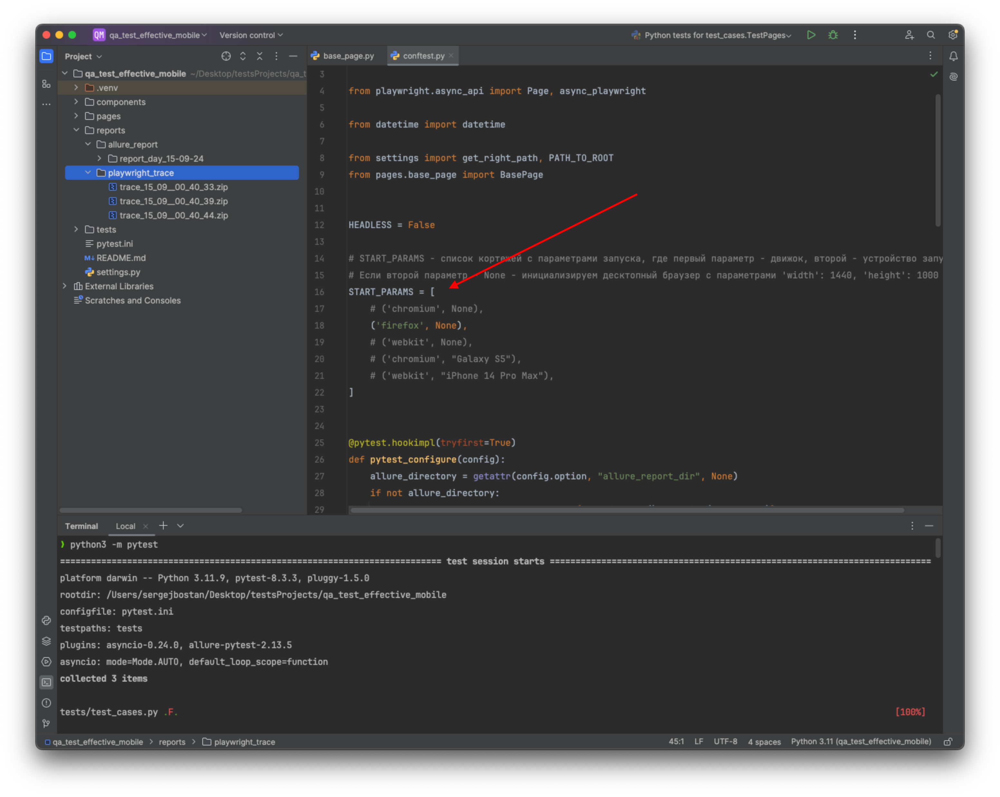
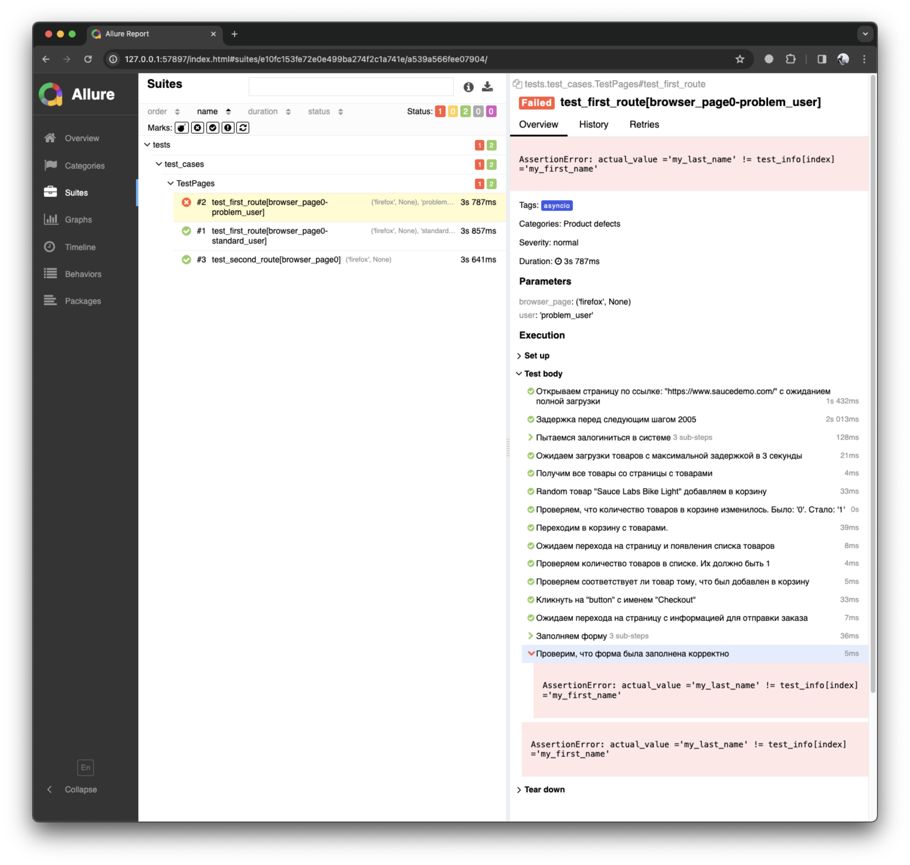
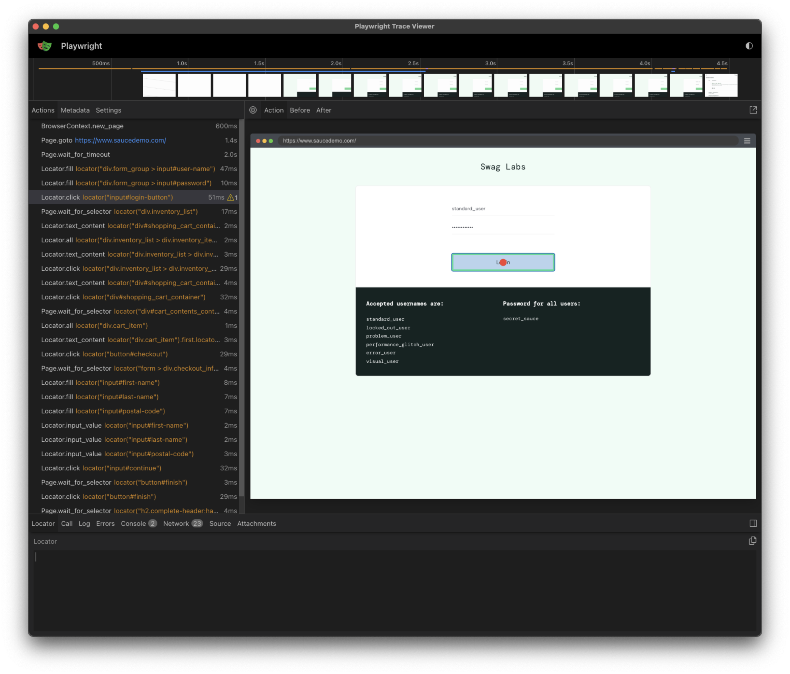

## Тестовое для Effective Mobile - QA Python

* Чтобы развернуть проект локально, выбери для проекта папку и клонируй репозиторий:
  ```shell
  git clone https://github.com/bostanSergei/test_Effective_Mobile.git
  ```
  
* Перейти в папку и установи виртуальное окружение
  ```shell
  cd test_Effective_Mobile
  python3 -m venv venv
  # или
  python -m venv venv
  ```

* Активировать только что созданное виртуальное окружение
  ```shell
  source venv/bin/activate # для macOS
  # или
  .\venv\Scripts\activate # для Windows
  ```

* Установить зависимости из requirements.txt
  ```shell
  pip install -r requirements.txt
  ```

* Дополнительно установить веб-браузеры для запуска UI тестов
  ```shell
  playwright install
  # или, если хочешь поставить только firefox:
  python3 -m playwright install firefox
  ```

* Создать файл с переменными окружения и заполнить его по образу .env_example
* Запустить написанные тесты
  ```shell
  python3 -m pytest
  # или
  python -m pytest
  # после завершения всех тестов в папке reports будет сформирован allure отчет и трассировка по UI тестам
  ```
  
* Если тесты предполагают запуск в docker контейнере или на linux без графической оболочки, вероятно потребуется установить дополнительные пакеты. Команда для запуска лежит в файле additional.txt

### Info

* В корне проекта есть моё актуальное резюме в pdf формате (не уверен, что дойдут руки до обновления на hh.ru)
* Оперативный способ связаться со мной - https://t.me/bosmc

### Дополнительная информация по проекту.

* Я реализовал обе части задания в одном репозитории. Все тесты лежат в папке test в корне проекта.
* UI тесты можно запустить на разных браузерах и устройствах. Для этого в test/conftest.py лежит список START_PARAMS
  \
  `Список устройств для UI тестов - сейчас запускается только на firefox`

* На каждый тест создается allure отчет. Отчеты лежат в reports/allure_report/
  ```shell
  # для того, чтобы просмотреть отчет нужно ввести команду
  allure serve reports/allure_report/имя_папки_с_датой_когда_отчет_был_сформирован
  ```
  
  \
  `Пример allure - отчета`

* По каждому тесту сохраняется трассировка. Лежат в reports/playwright_trace/
  ```shell
  # для того, чтобы просмотреть трассировку нужно ввести команду
  playwright show-trace reports/playwright_trace/имя_файла_с_трассировкой
  ```

  \
  `Пример скриншота из трассировки`
